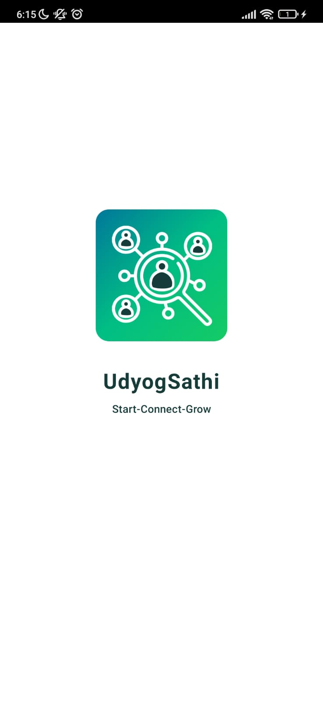
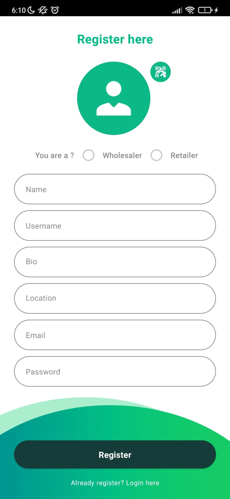
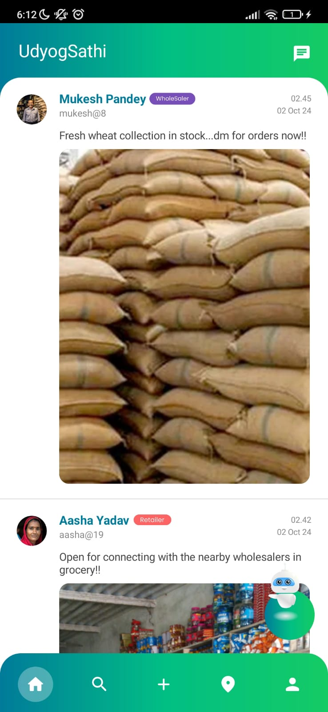
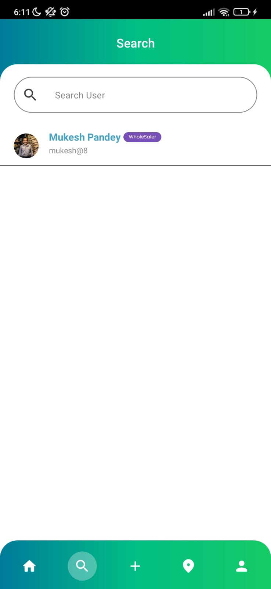
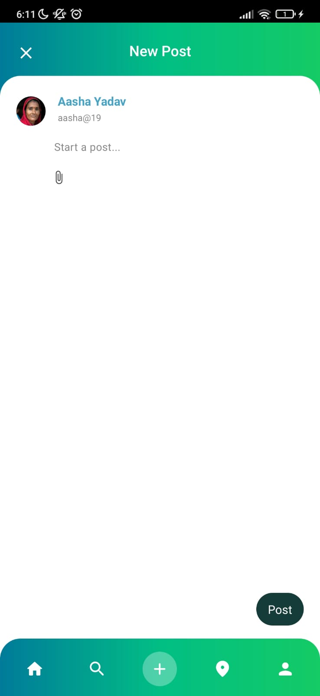
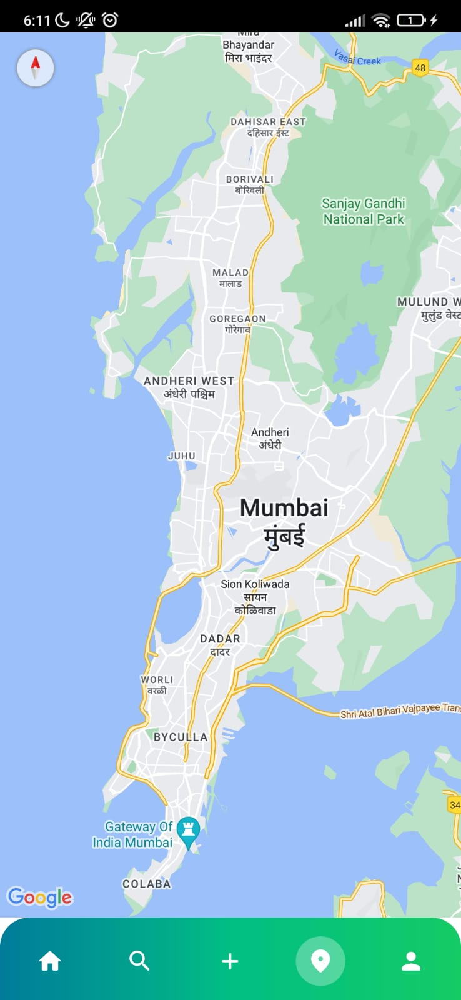
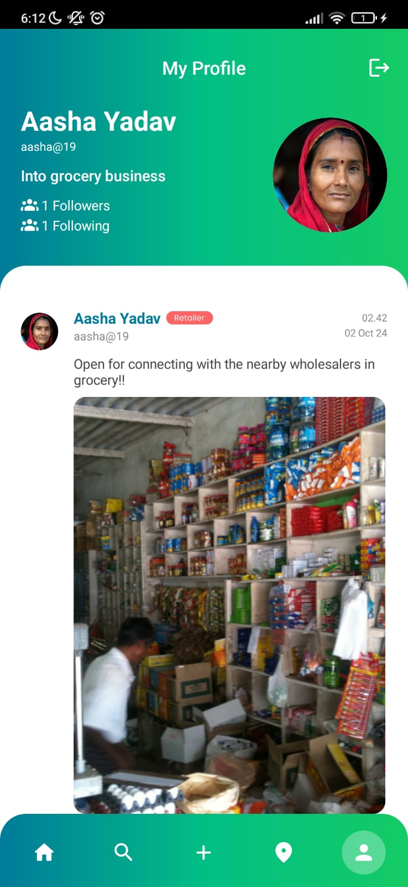
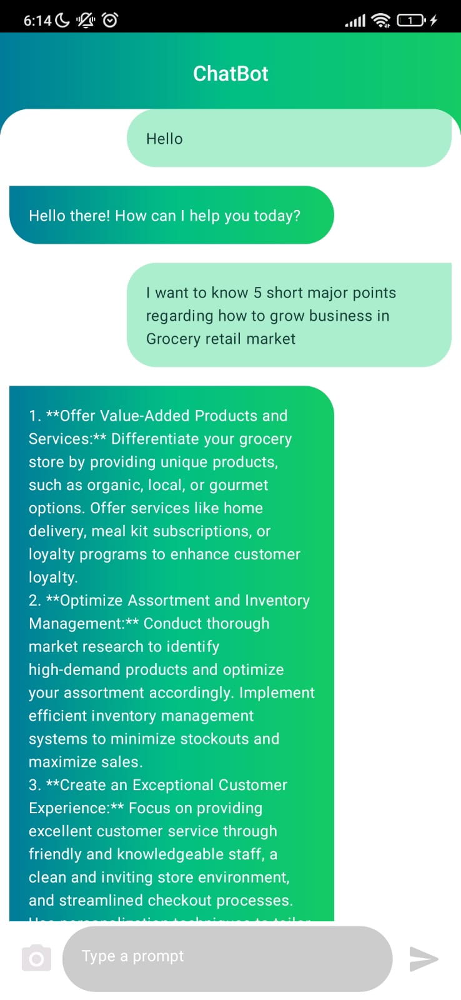

# UdyogSathi - Start,Connect,Grow
Connecting Wholesalers and Retailers for Seamless Communication and Business Growth

## Overview
UdyogSathi is a cutting-edge app designed to empower micro and small enterprises by bridging the gap between wholesalers and retailers. With advanced features like real-time communication, AI integration, and location-based services, UdyogSathi simplifies business interactions and fosters growth.

## Features
### Posts:
Users can create and share posts to showcase products and updates.
### Socket.IO Chat:
Real-time chat feature for seamless communication between wholesalers and retailers.
### Gemini AI Chatbot:
An AI-powered assistant to provide instant support and resolve queries efficiently.
### QR Code Integration:
Generate and scan QR codes for quick sharing of business information.
### Google Maps Integration:
Help users discover nearby wholesalers and retailers with ease using the Google Maps API.

## Technology Stack
### Frontend: 
Jetpack Compose for a modern and dynamic UI.
### Backend: 
Firebase for real-time database synchronization and authentication.
### Programming Language: 
Kotlin with Coroutines for efficient asynchronous programming.
### Image Loading: 
Coil for optimized image loading and caching.
### APIs: 
Google Maps API for location-based services and Socket.IO for real-time chat.

## Installation
### Clone the repository:
git clone https://github.com/your-username/UdyogSathi.git

Open the project in Android Studio.
Sync the Gradle dependencies.
Set up Firebase by adding your google-services.json file to the project.
Run the project on an emulator or a physical device.

## Screenshots

<table>
  <tr table border="0">
    <td></td>
    <td></td>
    <td></td>
  </tr>
  <tr>
    <td></td>
    <td></td>
    <td></td>
  </tr>
  <tr>
    <td></td>
    <td></td>
    <td></td>
  </tr>
</table>

